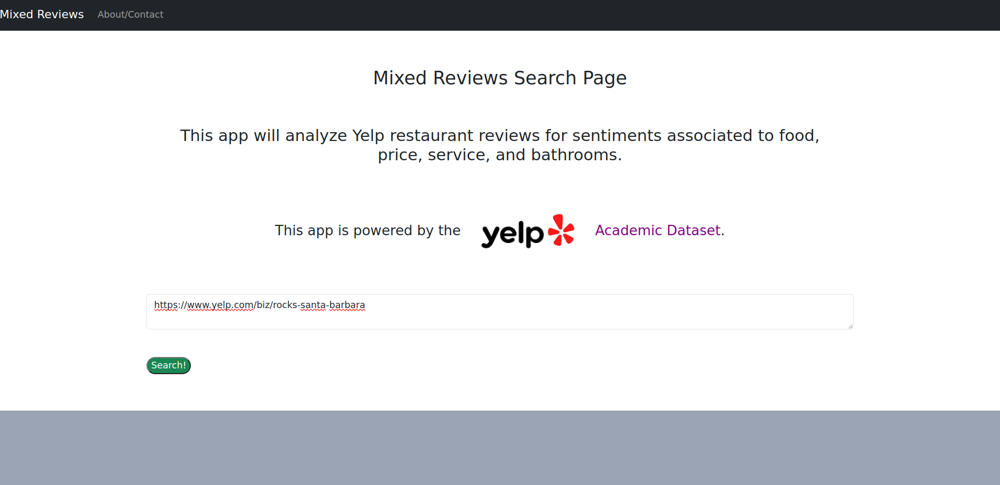
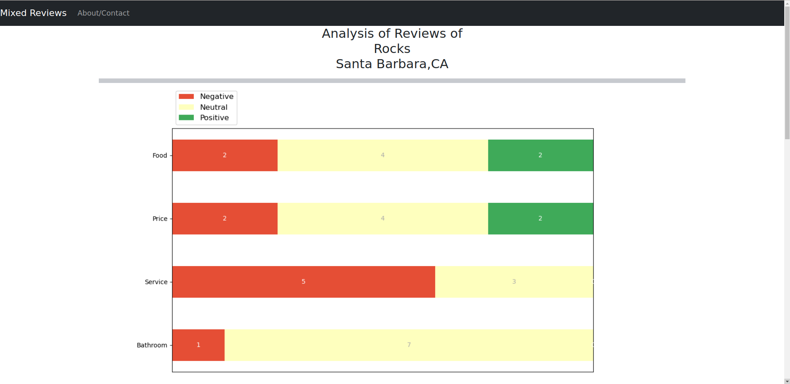
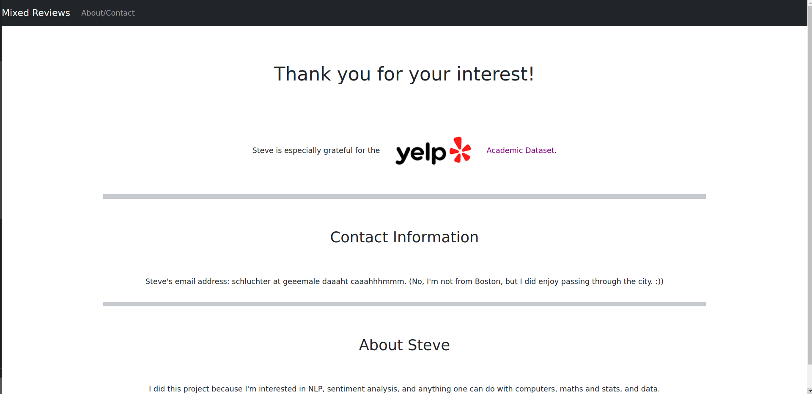

# Mixed Reviews

## By: Steve Schluchter

### This repository depends on the use of <a href='https://github.com/ScalaConsultants/Aspect-Based-Sentiment-Analysis'> Aspect Based Sentiment Analysis (linked here)</a>, which is an implementation of a BERT LLM.

### This repository also depends on the use of the <a href='https://www.yelp.com/dataset'>Yelp Academic Dataset</a>.

Mixed Reviews is a Flask app.

This webapp ingests a yelp restaurant reviews url and displays an aspect based sentiment analysis of the reviews according to the aforementioned model's predictions of the sentiments associated to: the food, price, service, and bathroom.  This analysis is in the form of a horizontal stacked bar chart produced by matlplotlib.

The webapp does a calculation of the probabilistic assessment of the Aspect Based Sentiment Analysis, which I hastily named the Steve Score.  The Steve Score is an effort to use the insightful, albeit somewhat 'noisy' probabilistic assessment to determine the strength of the overall assessment by considering all of the probabilities generated: positive, negative, and neutral.  The formula for the Steve Score is: $$ steve\_score = \frac{p(positive) - p(negative)}{p(neutral) + 10^{-12}}. $$

The idea behind the Steve Score is that either the positive or negative probability must be consierably larger than the other and the neutral probability must be small in order for the sentiment to be assessed to be nonneutral.  

I've included a beamer presentation, which illuminated the Steve Score with an example.  It's the only pdf in the repository.  You can't miss it.

Here are a few screenshots of the webapp in action.

